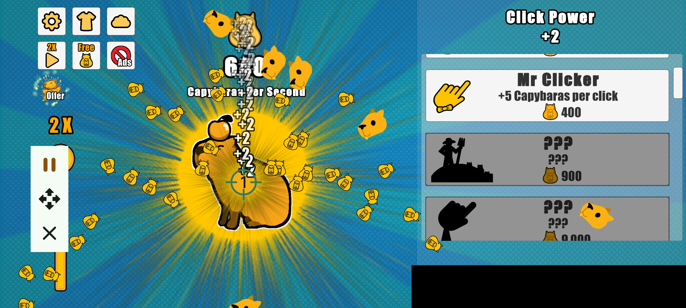

# Capybara Clicker Automation Script

This script is specifically optimized for the popular casual clicker game *Capybara Clicker*, designed to maximize your Capybaras Per Second (CPS) through intensive high-frequency tapping.

## 🌟 Features
* **Focused Single-Target Ultra-Fast Clicking:** Deployed a highly focused target point directly on the central Capybara to unleash the maximum potential click speed.
* **Efficiency Optimization:** Finely tuned click delays to prevent the app from lagging while achieving the absolute technical speed limit of the clicker.
* **Rapid Multiplier Stacking:** Accelerates your resource accumulation dramatically, allowing you to unlock upgrades like "Mr Clicker" and automated structures much faster without finger fatigue.

## 📸 UI Reference

  
  
<i>Optimized single-target layout for the Capybara Clicker game</i>

## 🚀 How to Use
1. **Download the Script:** Download the [AutoClickerFast_Capybara.json](./AutoClickerFast_Capybara.json) file from this directory to your phone.
2. **Import Configuration:** Open your **AutoClickerFast** app, navigate to Configuration Management, and select **Import** to load the `.json` file.
3. **Launch the Game:** Open the *Capybara Clicker* game, ensure your screen orientation matches, and press **Play** to start farming!

> 💡 **Need help importing?** Please follow the visual guide below for step-by-step instructions:
> 

>   
>   
<i>Step-by-step import instructions guide</i>

> 

---

## 📥 Stay Updated
Experience the most beautiful Material 3 interface on Android:

**Auto Clicker Fast: Empowering you with control beyond the touch screen.**

For more technical docs, visit our [Project Wiki](https://github.com/autoclickerfast/auto-clicker-guides/wiki).

