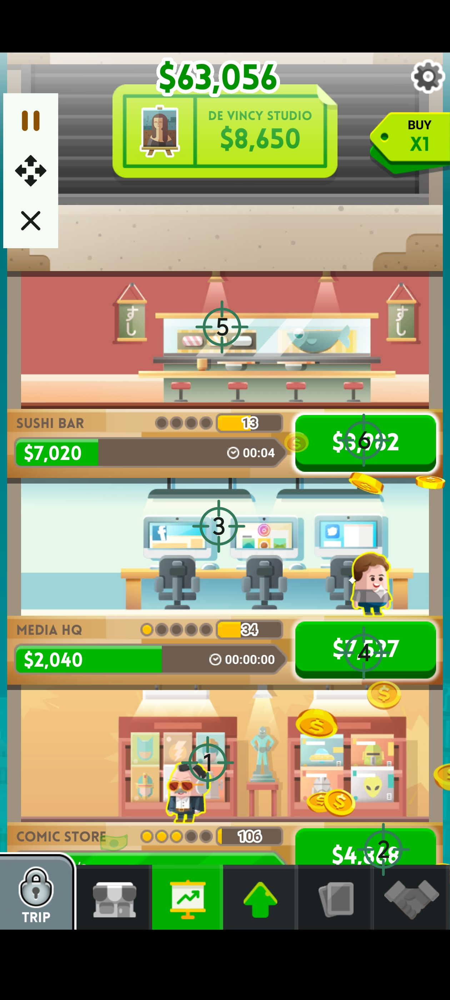

# Cash Inc. Automation Script

This script is specifically optimized for the idle business game *Cash Inc.*, designed to fully automate business tapping and revenue collection so you can grow your financial empire hands-free.

### 🌟 Features
* **Multi-Floor Auto Tapping:** Strategically mapped target points across different business sectors (such as Comic Store, Media HQ, and Sushi Bar) to ensure continuous operation.
* **Auto Revenue Collection:** Dedicated clicking zones automatically claim profits and cash increments the moment they become available.
* **True Idle Experience:** Eliminates the need to constantly stare at your device. Simply run the script in the background and check back periodically to manage your massive upgrades and profits.

### 📸 UI Reference

  
  
<i>Multi-target layout optimized for maximizing cash flow in Cash Inc.</i>

### 🚀 How to Use
1. **Download the Script:** Download the [AutoClickerFast_CashInc.json](./AutoClickerFast_CashInc.json) file from this directory to your phone.
2. **Import Configuration:** Open your **AutoClickerFast** app, navigate to Configuration Management, and select **Import** to load the `.json` file.
3. **Launch the Game:** Open the *Cash Inc.* game, ensure your screen orientation matches, and press **Play** to start farming!

> 💡 **Need help importing?** Please follow the visual guide below for step-by-step instructions:
> 

>   
>   
<i>Step-by-step import instructions guide</i>

> 

## 📥 Stay Updated
Experience the most beautiful Material 3 interface on Android:

**Auto Clicker Fast: Empowering you with control beyond the touch screen.**

For more technical docs, visit our [Project Wiki](https://github.com/autoclickerfast/auto-clicker-guides/wiki).

