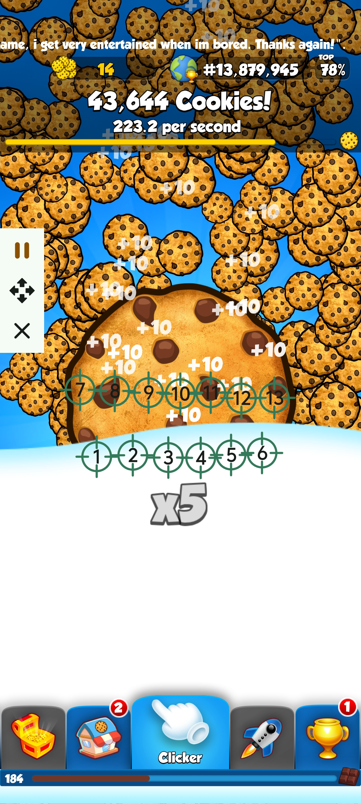
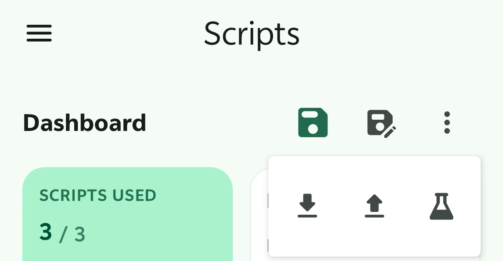

# Cookie Clicker Automation Script

## English

This script is specifically optimized for the mobile game *Cookies* (Cookie Clicker), designed to maximize your Cookies Per Second (CPS) and fully automate resource collection.

### 🌟 Features
* **Double-Row High-Frequency Tapping:** Deployed 13 target points (7 points in the first row, 6 points in the second row) covering the core clicking zone to trigger maximum combo multipliers (e.g., `x5` boost).
* **Efficiency Optimization:** Finely tuned click delays to prevent the app from lagging while achieving the absolute technical speed limit of the clicker.
* **Auto Collect & Capture:** Strategic placement of targets allows simultaneous fast clicks on the main cookie and automatic capturing of floating cookies and randomly dropped golden treasure chests.

### 📸 UI Reference

  
  
<i>13-Point multi-target layout optimized for the Cookies game</i>

### 🚀 How to Use
1. **Download the Script:** Download the `AutoClickerFast_Cookies.json` file from this directory to your phone.
2. **Import Configuration:** Open your **AutoClickerFast** app, navigate to Configuration Management, and select **Import** to load the `.json` file.
3. **Launch the Game:** Open the *Cookies* game, ensure your screen orientation matches, and press **Play** to start farming!

> 💡 **Need help importing?** Please follow the visual guide below for step-by-step instructions:
> 

>   
>   
<i>Step-by-step import instructions guide</i>

> 

---

## 📥 Stay Updated
Experience the most beautiful Material 3 interface on Android:

**Auto Clicker Fast: Empowering you with control beyond the touch screen.**

For more technical docs, visit our [Project Wiki](https://github.com/autoclickerfast/auto-clicker-guides/wiki).
