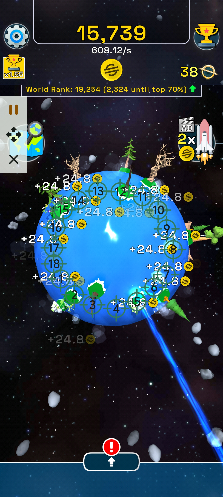

# Planet Evolution Automation Script

This script is specifically optimized for the mobile incremental game *Planet Evolution*, designed to maximize your generation speed and fully automate resource tapping across the planet surface.

## 🌟 Features
* **Circular Multi-Target Tapping:** Deployed 18 precisely arranged target points distributed in a circular layout to cover the entire planetary sphere for optimal tapping coverage.
* **Efficiency Optimization:** Finely tuned click delays to prevent the app from lagging while achieving the absolute technical speed limit of the clicker.
* **Auto Collect & Farm:** Strategic placement of targets allows continuous resource generation on the central planet while instantly catching floating bonuses and orbital drops.

## 📸 UI Reference

  
  
<i>18-Point circular layout optimized for the Planet Evolution game</i>

## 🚀 How to Use
1. **Download the Script:** Download the [AutoClickerFast_PlanetEvolution.json](./AutoClickerFast_PlanetEvolution.json) file from this directory to your phone.
2. **Import Configuration:** Open your **AutoClickerFast** app, navigate to Configuration Management, and select **Import** to load the `.json` file.
3. **Launch the Game:** Open the *Planet Evolution* game, ensure your screen orientation matches, and press **Play** to start farming!

> 💡 **Need help importing?** Please follow the visual guide below for step-by-step instructions:
> 

>   
>   
<i>Step-by-step import instructions guide</i>

> 

---

## 📥 Stay Updated
Experience the most beautiful Material 3 interface on Android:

**Auto Clicker Fast: Empowering you with control beyond the touch screen.**

For more technical docs, visit our [Project Wiki](https://github.com/autoclickerfast/auto-clicker-guides/wiki).

