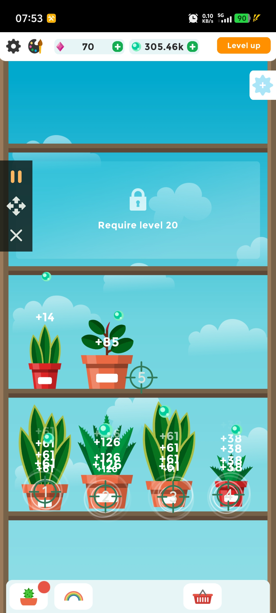

# Terrarium: Garden Idle Automation Script

This script is specifically optimized for the relaxing incremental game *Terrarium: Garden Idle*, designed to maximize your oxygen generation and fully automate tapping across your plant shelves.

## 🌟 Features
* **Multi-Shelf Plant Tapping:** Deployed highly focused target points aligned with individual potted plants across the garden shelves to unleash rapid oxygen production.
* **Efficiency Optimization:** Finely tuned click delays to prevent the app from lagging while achieving the absolute technical speed limit of the clicker.
* **Auto Oxygen Bubble Harvesting:** Strategic placement of targets ensures continuous manual production from your highest-earning plants while instantly popping floating oxygen bubbles nearby.

## 📸 UI Reference

  
  
<i>Multi-target shelf layout optimized for the Terrarium: Garden Idle game</i>

## 🚀 How to Use
1. **Download the Script:** Download the [AutoClickerFast_Terrarium.json](./AutoClickerFast_Terrarium.json) file from this directory to your phone.
2. **Import Configuration:** Open your **AutoClickerFast** app, navigate to Configuration Management, and select **Import** to load the `.json` file.
3. **Launch the Game:** Open the *Terrarium: Garden Idle* game, ensure your screen orientation matches, and press **Play** to start farming!

> 💡 **Need help importing?** Please follow the visual guide below for step-by-step instructions:
> 

>   
>   
<i>Step-by-step import instructions guide</i>

> 

---

## 📥 Stay Updated
Experience the most beautiful Material 3 interface on Android:

**Auto Clicker Fast: Empowering you with control beyond the touch screen.**

For more technical docs, visit our [Project Wiki](https://github.com/autoclickerfast/auto-clicker-guides/wiki).

